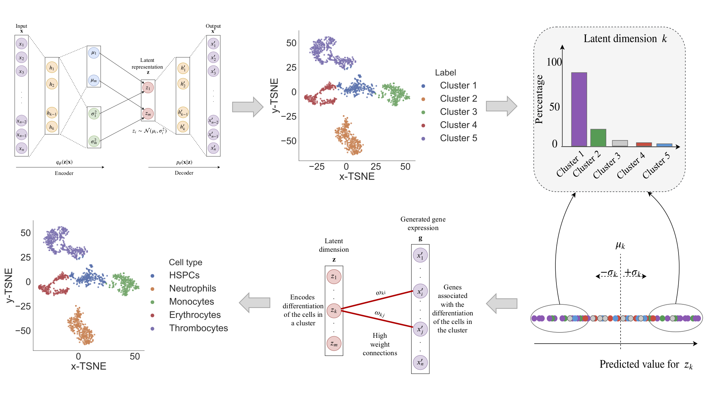

# Unsupervised generative and graph neural methods for modelling cell differentiation
Ioana Bica, Helena Andres-Terre, Ana Cvejic, Pietro Lio

## Dependencies

The project was implemented in Python 3.6. The following packages are needed for running the models and 
performing the analysis:
- numpy, pandas, scipy, scikit-learn
- keras, tensorflow
- matplotlib, seaborn

## DiffVAE

DiffVAE is a variational autoencoder that can be used to model and study the 
differentiation of cells using gene expression data. In particular, DiffVAE uses disentanglement methods 
based on information theory to improve the data representation and achieve better separation of 
the biological factors of variation in the gene expression data. 

This allows us to develop methodology for identifying the cell types in a dataset using DiffVAE. The 
pipeline is illustred in the following figure: 



To train DiffVAE using gene expression data, run the following command with the chosen command line arguments. 

```bash
python train_DiffVAE.py
```
```
Options :
		--gene_expression_filename 'data/Zebrafish/GE_mvg.csv'	# Path to file containing the log normalized gene expression data.
		--hidden_dimensions 512 256 # List of hidden dimensions for the layers in the encoder.
		                                 The layers in the decoder will have the same dimensions in reversed order.
		--latent_dimension 50 # Size of latent dimension.
		--batch_size 128 # Batch size to use during training.
		--learning_rate 0.001 # Learning rate used during training.
		--model_name 'DiffVAE_test' # Name used to save the model.
```

Example usage:
```bash
python train_DiffVAE.py --gene_expression_filename 'data/Zebrafish/GE_mvg.csv' --hidden_dimensions 512 256 \
--latent_dimension 50 --batch_size 128 --learning_rate 0.001 --model_name 'DiffVAE_test'
```

After running `train_DiffVAE.py`, the encoder and decoder parts of DiffVAE will be saved to the directories 
Saved-Models/Encoders/ and Saved-Models/Decoders/ respectively using the model name provided. 

Note that the hyperparameters of the model should be tuned for each new dataset. 

The notebook `DiffVAE_methodology.ipynb` goes through the steps needed for identyifing the cell types in the dataset 
and for performing cell perturbations. These steps are illustrated on the Zebrafish dataset.

## Graph-DiffVAE

Graph-DiffVAE is a graph variational autoencoder where the encoder and the decoder networks 
are graph convolutional networks. Graph-DiffVAE can be used to explore links between cells in an unsupervised way as 
illustrated in the following figure: 


To train Graph-DiffVAE using gene expression data, run the following command with the chosen command line arguments. 

```bash
python train_GraphDiffVAE.py
```
```
Options :
		--gene_expression_filename 'data/Zebrafish/GE_mvg.csv'	# Path to file containing the log normalized gene expression data.
		--hidden_dimensions [512] # List of hidden dimensions for the layers in the encoder.
		                                 The layers in the decoder will have the same dimensions in reversed order.
		--latent_dimension 50 # Size of latent dimension.
		--learning_rate 0.0001 # Learning rate used during training.
		--model_name 'GraphDiffVAE_test' # Name used to save the results.
```

Example usage:
```bash
python train_GraphDiffVAE.py --gene_expression_filename 'data/Zebrafish/GE_mvg.csv' --hidden_dimensions 512 \
--latent_dimension 50 --learning_rate 0.0001 --model_name 'GraphDiffVAE_test'
```

After running `train_GraphDiffVAE.py`, the input adjacency matrix, predicted adjacency matrix and latent node features 
will be saved to 'results/Graphs/' using the model name provided. The predicted adjacency matrix consists of the 
edges generated by Graph-DiffVAE.

Note that for this specific example, the input adjacency matrix is contructed by connecting each cell to the 
highest positively correlated cell (as measured by the Pearson correlation).  However, if prior biological knowledge 
is available about existing links between cells, this can be incorporated into the input graph. Based on this, 
Graph-DiffVAE will generate other links between cells that share the same biological meaning as the input ones.


